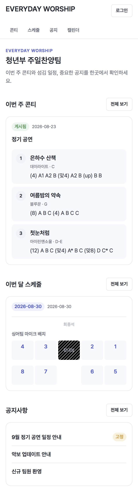
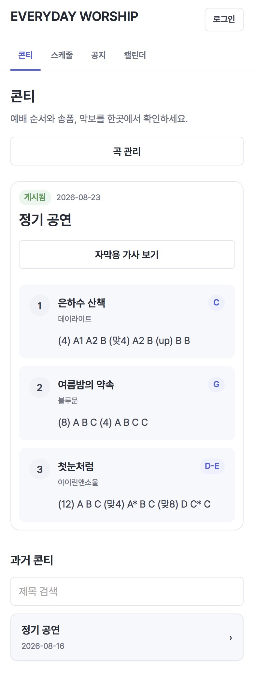
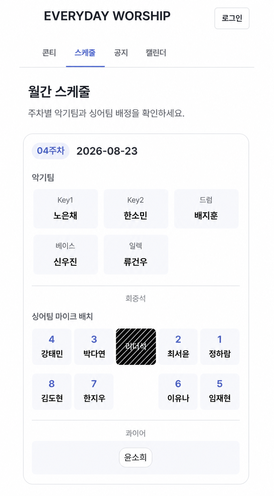
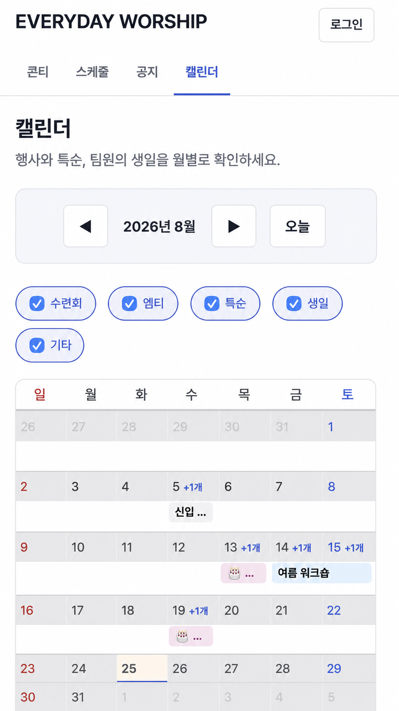

# Everyday Worship

> 카카오톡 이미지와 스프레드시트에 흩어진 콘티·악보·섬김 일정을 한곳에서 관리하는 찬양팀 전용 웹 서비스

## 프로젝트 소개

Everyday Worship은 청운교회 청년부 주일찬양팀의 실제 운영 흐름을 바탕으로 만든 모바일 우선 웹 서비스다.
매주 새로 공유되는 콘티와 악보, 월별 섬김 일정, 공지와 행사를 한곳에서 최신 상태로 확인할 수 있게 한다.

단순히 정보를 모으는 데서 그치지 않고, 반복적인 입력 작업을 줄이기 위해 AI 콘티 이미지 인식과
참·불참 텍스트 파싱을 제공한다. AI 결과는 바로 확정하지 않으며, 리더가 검수하고 수정한 뒤 게시하는
`제안 → 사람 검수 → 확정` 구조를 따른다.

## 주요 화면

<table>
  <tr>
    <td align="center"><br><sub>홈 — 콘티·스케줄·공지 요약</sub></td>
    <td align="center"><br><sub>콘티 — 곡·키·송폼 확인</sub></td>
  </tr>
  <tr>
    <td align="center"><br><sub>월간 스케줄 — 악기팀·마이크 배치</sub></td>
    <td align="center"><br><sub>캘린더 — 행사·특순·생일</sub></td>
  </tr>
</table>

## 해결하려는 문제

- 카카오톡 대화가 쌓이면 최신 콘티와 악보를 다시 찾기 어렵다.
- 스프레드시트 원본과 캡처한 공지 이미지가 분리되어 수정 시 내용이 달라질 수 있다.
- 매주 콘티 이미지와 참·불참 메시지를 사람이 다시 옮겨 적어야 한다.
- 고정된 마이크 위치가 표 안의 이름만으로 전달되어 무대 배치를 한눈에 파악하기 어렵다.
- 비정기 행사와 팀 공지를 지속해서 확인할 공용 공간이 없다.

## 주요 기능

### 콘티와 악보

- 최신 콘티와 과거 콘티 조회
- 곡 순서·키·송폼 관리
- 악보 PDF와 원본 콘티 이미지 보관
- 콘티 이미지에서 날짜·곡·키·송폼을 AI로 추출
- 기존 곡 유사 후보와 지난 송폼 비교를 활용한 사람 검수
- 송폼 순서에 맞춘 자막용 가사 조합

실제 콘티 이미지 5장, 27곡으로 측정한 AI 인식의 필드 단위 정확도는 94.8%였다. 작은 글자의 송폼
약어는 오인식 가능성이 있어 검수 단계를 필수로 유지한다.

### 월간 섬김 일정

- 싱어팀과 악기팀의 월별·주차별 배정 관리
- 마이크 1~8번의 실제 무대 위치 시각화
- 콰이어와 악보 담당자 다중 배정
- 월간·연간 마이크 배정 횟수 표시
- 카카오톡 참·불참 텍스트 일괄 파싱과 팀별 검수
- 참석 여부와 기존 배정 횟수를 이용한 싱어팀 배정 제안

배정 결과는 자동 저장하지 않는다. 시스템이 빈 슬롯의 후보를 제안하면 리더가 그대로 사용하거나
수정한 뒤 확정한다.

### 공지와 캘린더

- 고정 공지와 일반 공지 작성·조회
- 비정기 행사 캘린더 관리
- 공지의 특순 일정을 캘린더에 단방향 동기화
- 활동 중인 팀원의 생일을 매년 자동 표시
- 로그인한 팀원의 공지·캘린더 댓글 작성

### 계정과 권한

- Supabase Auth 기반 이메일·비밀번호 로그인
- `admin` / `leader` / `member` 3단계 역할
- 일반 콘텐츠는 비로그인 조회 허용
- 인명부와 가사는 로그인한 팀원만 조회
- 참·불참 사유와 배정 제안은 리더십만 조회
- 관리자 역할 변경, 임시 비밀번호 발급, 계정 삭제

## 핵심 설계 원칙

### 최신 데이터의 원본은 하나만 둔다

특순은 공지사항, 생일은 인명부를 원본으로 삼아 캘린더로 한 방향만 동기화한다. 두 화면에서 같은
데이터를 각각 수정하게 만들어 다시 버전 불일치가 생기는 것을 막는다.

### AI는 판단을 대신하지 않는다

AI는 이미지와 텍스트를 구조화해 초안을 제안한다. 곡 매칭, 송폼 확인, 참·불참 확정과 최종 배정은
사람이 검수한다. 예외가 많은 실제 운영에서는 완전 자동화보다 수정 가능한 제안이 더 신뢰할 수 있다고
판단했다.

### 작은 팀에 필요한 범위만 다룬다

교인 전체 관리, 헌금, 출석, 결제 같은 종합 교회 관리 기능은 포함하지 않는다. 22명 규모 찬양팀이
매주 반복해서 사용하는 콘티·공지·스케줄·캘린더 흐름에 집중한다.

## 기술 스택

| 영역 | 기술 | 역할 |
|---|---|---|
| Frontend | React 19, Vite, React Router | 모바일 우선 반응형 UI와 SPA 라우팅 |
| Backend | FastAPI, Pydantic | REST API, 권한 검사, 비즈니스 로직 |
| Database | Supabase PostgreSQL | 관계형 데이터와 접근 정책 |
| Auth / Storage | Supabase Auth, Storage | 역할 기반 인증과 악보 파일 보관 |
| AI | OpenAI Vision API | 콘티 이미지와 참·불참 텍스트 구조화 |
| Deployment | Vercel, Render | 프론트엔드·백엔드 분리 배포 |

프론트엔드는 Supabase 데이터베이스를 직접 조회하지 않는다. 모든 데이터는 FastAPI의
`/api/v1/...` REST API를 거치며, 백엔드는 Router → Service → Repository 계층으로 책임을 나눈다.

```text
React / Vercel
      │
      │ REST API
      ▼
FastAPI / Render
      │
      ├── Supabase PostgreSQL
      ├── Supabase Auth · Storage
      └── OpenAI API
```

## 프로젝트 현황

- 핵심 기능과 확장 기능 구현 완료
- Vercel + Render 테스트 배포 완료
- FastAPI API 63개 명세 동기화
- Backend 테스트 71건 통과
- Frontend 빌드·정적 검사 통과
- 실제 모바일 기기에서 로그인·캘린더 반응형 문제를 발견하고 수정
- 현재 소수 실사용자 테스트와 README·트러블슈팅 정리 진행 중

## 로컬 실행

### 1. Supabase 준비

1. Supabase 프로젝트를 생성한다.
2. SQL Editor에서 [`docs/schema.sql`](docs/schema.sql)을 실행한다.
3. Storage에 `sheet-files` 이름의 Private 버킷을 만든다.
4. Project Settings에서 Project URL, anon key, service role key를 확인한다.

`service_role` 키는 RLS를 우회할 수 있으므로 백엔드 환경변수에만 저장한다. 프론트엔드 코드나
브라우저 환경변수에 넣지 않는다.

### 2. Backend

Python 가상환경을 만든 뒤 의존성을 설치한다.

```bash
cd backend
python -m venv .venv
```

Windows PowerShell:

```powershell
.\.venv\Scripts\Activate.ps1
pip install -r requirements.txt
Copy-Item .env.example .env.local
uvicorn app.main:app --reload
```

macOS 또는 Linux:

```bash
source .venv/bin/activate
pip install -r requirements.txt
cp .env.example .env.local
uvicorn app.main:app --reload
```

`backend/.env.local`에 자신의 Supabase 키와 OpenAI API 키를 입력한다. 서버가 실행되면
`http://localhost:8000/docs`에서 Swagger API 문서를 확인할 수 있다.

### 3. Frontend

새 터미널에서 다음 명령을 실행한다.

```bash
cd frontend
npm install
```

Windows PowerShell:

```powershell
Copy-Item .env.example .env.local
npm run dev
```

macOS 또는 Linux:

```bash
cp .env.example .env.local
npm run dev
```

기본 설정에서는 프론트엔드가 `http://localhost:8000/api/v1`의 백엔드에 연결된다. Vite가 출력한
로컬 주소로 접속하면 된다.

### 4. 최초 관리자 설정

회원가입한 계정은 모두 `member`로 생성된다. 최초 관리자 한 명은 Supabase SQL Editor에서 해당 계정의
UUID를 확인한 뒤 한 번만 직접 승격한다.

```sql
update user_profiles
set role = 'admin'
where id = 'AUTH_USER_UUID';
```

이후 `admin`은 애플리케이션의 사용자 관리 화면에서 다른 계정을 `leader` 또는 `member`로 변경할 수 있다.

## 환경변수

실제 값은 Git에 커밋하지 않는다. 로컬에서는 예시 파일을 `.env.local`로 복사해 사용한다.

### Backend

| 변수 | 필수 | 설명 |
|---|---|---|
| `SUPABASE_URL` | 예 | Supabase 프로젝트 URL |
| `SUPABASE_ANON_KEY` | 예 | 로그인·회원가입과 사용자 토큰 검증에 사용하는 공개 클라이언트 키 |
| `SUPABASE_SERVICE_ROLE_KEY` | 예 | 서버의 DB·Storage 접근용 비밀 키. 백엔드에서만 사용 |
| `OPENAI_API_KEY` | AI 기능 사용 시 | 콘티 이미지와 참·불참 텍스트 인식 |
| `OPENAI_VISION_MODEL` | 아니요 | 기본값 `gpt-4o`; vision과 JSON 응답을 지원하는 모델 |
| `CORS_ALLOWED_ORIGINS` | 운영 배포 시 | 쉼표로 구분한 허용 프론트엔드 출처. 로컬 주소는 기본 허용 |

### Frontend

| 변수 | 필수 | 설명 |
|---|---|---|
| `VITE_API_BASE_URL` | 예 | FastAPI의 `/api/v1`까지 포함한 기본 URL |

## 테스트와 빌드

Backend:

```bash
cd backend
pytest
```

Frontend:

```bash
cd frontend
npm run lint
npm run build
```

## 문서

- [제품 정의와 기능 범위](docs/README.md)
- [전체 개발 로드맵과 트러블슈팅](docs/전체_로드맵.md)
- [API 명세](docs/API명세.md)
- [ERD와 설계 근거](docs/ERD.md)
- [Supabase 스키마](docs/schema.sql)
- [디자인 시스템](docs/DESIGN.md)
- [공개 화면 캡처 가이드](docs/screenshots/README.md)

## 개인정보와 콘텐츠

문서의 인물명과 예시는 모두 가명이다. 실제 팀원의 연락처와 운영 중인 스프레드시트 원본은 저장소에
포함하지 않는다. 저작권이 있는 가사와 개인정보가 포함된 인명부는 로그인 사용자에게만 제공한다.

---

LG DX SCHOOL 바이브코딩 개인 프로젝트 · 2026.08.17 ~ 2026.08.28
