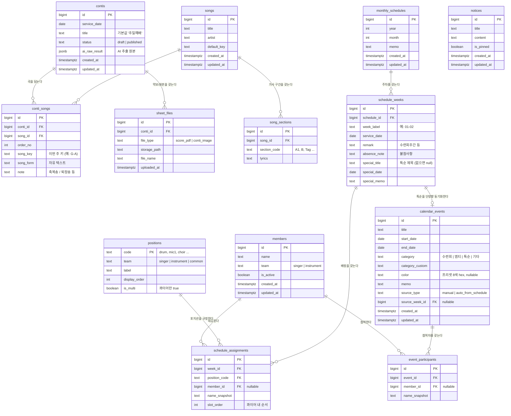

# ERD — 청년부 주일찬양팀 웹

> 기준일: 2026-08-18 / DB: Supabase (PostgreSQL)
> 설계 결정: ① 곡(songs) 마스터 분리 ② 배정은 세로형 assignments 테이블 ③ 팀원 참조는 `member_id` FK + 이름 스냅샷 병행

---

## 1. 엔티티 개요

| # | 테이블 | 역할 | 소속 기능 |
|---|---|---|---|
| 1 | `members` | 인명부 (배정 드롭다운의 마스터 데이터) | 공통 |
| 2 | `positions` | 포지션 마스터 (악기 7종 + 마이크 1~8 + 콰이어 등) | 공통 |
| 3 | `contis` | 콘티 1건 (= 날짜 + 제목) | 기능 1 |
| 4 | `songs` | 곡 마스터 (제목·아티스트·기본키) | 기능 1 |
| 5 | `conti_songs` | 콘티별 곡 배치 (순서·이번 주 키·송폼) | 기능 1 |
| 6 | `sheet_files` | 악보 PDF / 콘티 원본 이미지 | 기능 1 |
| 7 | `notices` | 일반 공지사항 | 기능 2 |
| 8 | `monthly_schedules` | 월간 스케줄 (연·월 단위) | 기능 2 |
| 9 | `schedule_weeks` | 주차별 행 (불참사항·비고·특순) | 기능 2 |
| 10 | `schedule_assignments` | 주차별 포지션 배정 (세로형) | 기능 2 |
| 11 | `calendar_events` | 캘린더 이벤트 | 기능 3 |
| 12 | `event_participants` | 이벤트 참여 인원 | 기능 3 |
| — | `song_sections` | 곡별 가사 구간(A/B/C) 매핑 — **확장 범위, MVP 제외** | 확장 |

---

## 2. ERD 다이어그램



---

## 3. 설계 결정과 근거

### 3-1. 곡(songs) 마스터 분리

같은 곡이 매주 반복해서 등장하므로, 제목·아티스트를 콘티마다 중복 저장하면 표기 흔들림(축약 팀명, 특수문자)이 누적된다.

- **불변 속성**(제목, 아티스트, 기본 키) → `songs`
- **주간 가변 속성**(이번 주 순서, 이번 주 키, 송폼) → `conti_songs`

확장 기능인 "가사 구간(A/B/C) 매핑 재사용"은 곡 단위로 매핑을 누적해야 성립하므로, 이 구조가 없으면 나중에 마이그레이션이 필요하다. 지금 나눠두면 확장 시 `song_sections` 테이블만 추가하면 된다.

> **주의 — AI 추출 시 곡 매칭**: 이미지에서 뽑은 제목이 기존 `songs`에 있는 곡인지 판단하는 로직이 필요하다. MVP에서는 **정규화된 제목(공백·특수문자 제거) 완전 일치**로 후보를 찾고, 일치하는 게 없으면 신규 곡으로 제안하되 **검수 화면에서 사람이 "기존 곡 선택 / 새로 등록"을 확정**하도록 한다. 유사도 기반 자동 매칭은 하지 않는다.

### 3-2. 배정은 세로형(`schedule_assignments`)

한 행 = "한 사람의 한 배정". `position_code`가 `drum`, `mic3`, `choir` 식이다.

- **콰이어가 결정적이다.** 콰이어는 인원 수가 매주 다르므로(0~3명) 가로형 와이드 테이블에서는 별도 처리가 필요하다. 세로형이면 같은 테이블에 행만 더 쌓으면 된다.
- 포지션이 추가돼도 `ALTER TABLE` 없이 `positions`에 행만 추가하면 된다.
- **비용**: 화면에 뿌릴 때 `position_code`를 키로 하는 객체로 한 번 피벗해야 한다. 백엔드 서비스 레이어에서 `{ mic1: {...}, drum: {...}, choir: [...] }` 형태로 변환해 응답하면 프론트는 그대로 렌더한다. 이 변환 함수 하나가 추가 비용의 전부다.

### 3-3. `member_id` FK + `name_snapshot` 병행

- 평상시엔 `member_id`로 인명부와 연결되어 이름 변경이 자동 반영된다.
- 인명부에 없는 인물(과거 데이터의 탈퇴자, `01우진` 같은 동명이인 구분 표기)은 `member_id`를 `null`로 두고 `name_snapshot`에만 이름을 남긴다.
- 조회 시 `COALESCE(members.name, name_snapshot)`으로 표시한다.
- 덕분에 **과거 스프레드시트 데이터를 인명부 정리 없이 먼저 이관**할 수 있다.

### 3-4. 특순 단방향 동기화

`schedule_weeks.special_title`이 원본이다.

- 저장 시 서버가 `calendar_events`에 `source_type='auto_from_schedule'`, `source_week_id=<주차 id>`인 행을 **upsert**한다.
- `special_title`이 비워지면 해당 이벤트를 삭제한다.
- `source_type='auto_from_schedule'`인 이벤트는 **캘린더 API에서 수정·삭제를 거부**한다(서버에서 차단). 프론트에서도 편집 버튼 대신 "공지사항에서 수정" 안내를 띄운다.
- 이 제약이 없으면 두 곳의 값이 어긋나는, 이 프로젝트가 없애려는 문제가 그대로 재발한다.

### 3-5. 비밀번호 게이트는 테이블로 두지 않는다

편집용 비밀번호는 **환경변수(`EDIT_PASSWORD`)** 로 관리하고, DB 테이블을 만들지 않는다. 값이 하나뿐이고 변경 빈도가 사실상 없으며, 테이블로 두면 "비밀번호 관리 화면"이라는 범위 밖 기능이 따라붙는다.

---

## 4. 포지션 마스터 초기 데이터

| code | team | label | display_order | is_multi |
|---|---|---|---|---|
| `key1` | instrument | Key1 | 1 | false |
| `key2` | instrument | Key2 | 2 | false |
| `drum` | instrument | 드럼 | 3 | false |
| `bass` | instrument | 베이스 | 4 | false |
| `electric` | instrument | 일렉 | 5 | false |
| `singer_helper` | instrument | 싱도/자막 | 6 | false |
| `inst_score` | instrument | 악보 | 7 | false |
| `mic1` ~ `mic8` | singer | 마이크 1 ~ 8 | 11 ~ 18 | false |
| `choir` | singer | 콰이어 | 19 | **true** |
| `singer_caption` | singer | 자막 | 20 | false |
| `singer_score` | singer | 악보 | 21 | **true** |
| `special` | common | 특순 | 30 | true |

> `singer_helper`(싱도)는 신디사이저가 아니라 **"싱어팀 도우미"** 를 뜻하는 팀 내부 용어다. 악기팀 컬럼에 위치하지만 사람 역할이다.
> `singer_score`(싱어 악보)는 보통 2명이 나눠 맡아 `is_multi=true`다. 같은 포지션의 악기 악보(`inst_score`)는 1명이 맡아 `false`로 유지한다.

### 마이크 무대 좌표 (DB 아님 — 프론트 상수)

```
        (회중석)
   4   3   목사님   2   1      ← 앞줄
   8   7           6   5      ← 뒷줄
        (콰이어)
```

무대 구조가 고정이므로 좌표는 프론트 상수로 하드코딩하고, DB에는 "어느 마이크에 누가 서는가"만 저장한다.

---

## 5. Supabase DDL 초안

`schema.sql` 파일로 함께 제공. Supabase SQL Editor에 붙여넣어 실행하면 된다.

주요 제약 요약:

- `contis`: `UNIQUE(service_date, title)` — 같은 날 같은 제목의 콘티 중복 방지 (수련회 다건은 제목이 달라 허용됨)
- `conti_songs`: `UNIQUE(conti_id, order_no)` — 곡 순서 중복 방지
- `songs`: `UNIQUE(title, artist)`
- `monthly_schedules`: `UNIQUE(year, month)`
- `schedule_assignments`: `is_multi=false`인 포지션은 주차당 1명만 — **부분 유니크 인덱스**로 처리 (`choir`, `special`, `singer_score` 제외)
- 모든 FK는 부모 삭제 시 `ON DELETE CASCADE` (콘티 삭제 → 곡 배치·악보 함께 삭제)

### RLS 정책

MVP는 로그인이 없고 **FastAPI 서버만 DB에 접근**한다(브라우저가 Supabase에 직접 접근하지 않음).

- 모든 테이블 RLS **활성화 + 정책 없음** → `anon` 키로는 아무것도 못 읽음
- 서버는 `service_role` 키를 사용해 RLS를 우회
- 조회/편집 권한 판별은 **FastAPI 레이어**에서 처리 (편집은 비밀번호 게이트)

---

## 6. 다음 단계

- [ ] `schema.sql`을 Supabase에 실행하고 대시보드에서 테이블 확인
- [ ] `positions` 초기 데이터 seed
- [ ] 실제 인명부 데이터를 `members`에 입력 (약 20명)
- [ ] 8월 스케줄 1개월치를 샘플로 입력해 세로형 구조 검증
- [ ] API 명세 (FastAPI 라우터 설계 → Swagger 자동 생성)
