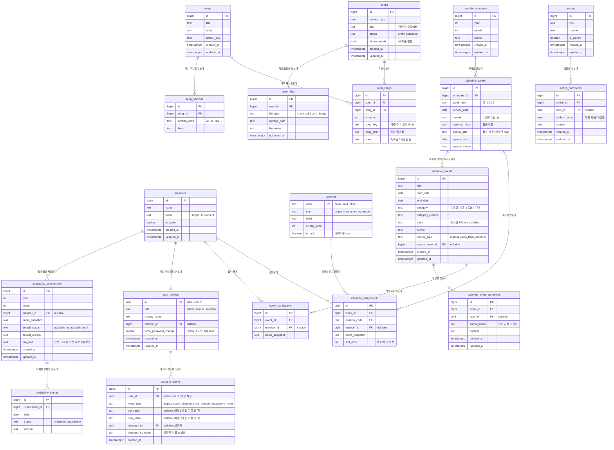

# ERD — 청년부 주일찬양팀 웹

> 기준일: 2026-08-18 / DB: Supabase (PostgreSQL)
> 설계 결정: ① 곡(songs) 마스터 분리 ② 배정은 세로형 assignments 테이블 ③ 팀원 참조는 `member_id` FK + 이름 스냅샷 병행

---

## 1. 엔티티 개요

| # | 테이블 | 역할 | 소속 기능 |
|---|---|---|---|
| 1 | `members` | 인명부 (배정 드롭다운의 마스터 데이터) | 공통 |
| 2 | `positions` | 포지션 마스터 (악기 7종 + 마이크 1~8 + 콰이어 등) | 공통 |
| 3 | `contis` | 콘티 1건 (= 날짜 + 제목) | 기능 1 |
| 4 | `songs` | 곡 마스터 (제목·아티스트·기본키) | 기능 1 |
| 5 | `conti_songs` | 콘티별 곡 배치 (순서·이번 주 키·송폼) | 기능 1 |
| 6 | `sheet_files` | 악보 PDF / 콘티 원본 이미지 | 기능 1 |
| 7 | `notices` | 일반 공지사항 | 기능 2 |
| 8 | `monthly_schedules` | 월간 스케줄 (연·월 단위) | 기능 2 |
| 9 | `schedule_weeks` | 주차별 행 (불참사항·비고·특순) | 기능 2 |
| 10 | `schedule_assignments` | 주차별 포지션 배정 (세로형) | 기능 2 |
| 11 | `calendar_events` | 캘린더 이벤트 | 기능 3 |
| 12 | `event_participants` | 이벤트 참여 인원 | 기능 3 |
| 13 | `user_profiles` | 로그인 계정별 역할(admin/leader/member) — Phase 7 | 공통 |
| 14 | `song_sections` | 곡별 가사 구간(A/B/C) 매핑 — Phase 9 | 기능 1 |
| 15 | `account_events` | 계정 보안 이벤트 로그(이름/역할 변경, 비밀번호 초기화) — Phase 7 후속 | 공통 |
| 16 | `notice_comments` | 공지사항 댓글 — Phase 10 | 기능 2 |
| 17 | `calendar_event_comments` | 캘린더 이벤트 댓글 — Phase 10 | 기능 3 |
| 18 | `availability_submissions` | 참/불참 텍스트 파싱 결과(사람×월 제출) — Phase 11-B | 기능 2 |
| 19 | `availability_entries` | 제출된 날짜별 참/불참 항목 — Phase 11-B | 기능 2 |

---

## 2. ERD 다이어그램



---

## 3. 설계 결정과 근거

### 3-1. 곡(songs) 마스터 분리

같은 곡이 매주 반복해서 등장하므로, 제목·아티스트를 콘티마다 중복 저장하면 표기 흔들림(축약 팀명, 특수문자)이 누적된다.

- **불변 속성**(제목, 아티스트, 기본 키) → `songs`
- **주간 가변 속성**(이번 주 순서, 이번 주 키, 송폼) → `conti_songs`

"가사 구간(A/B/C) 매핑 재사용"(Phase 9, `song_sections`)은 곡 단위로 매핑을 누적해야 성립하므로, 애초에 이 구조로 나눠둔 덕분에 마이그레이션 없이 테이블 하나만 추가해 구현할 수 있었다. 자세한 설계는 3-7절 참고.

> **주의 — AI 추출 시 곡 매칭**: 이미지에서 뽑은 제목이 기존 `songs`에 있는 곡인지 판단하는 로직이 필요하다. MVP에서는 **정규화된 제목(공백·특수문자 제거) 완전 일치**로 후보를 찾고, 일치하는 게 없으면 신규 곡으로 제안하되 **검수 화면에서 사람이 "기존 곡 선택 / 새로 등록"을 확정**하도록 한다. 유사도 기반 자동 매칭은 하지 않는다.

### 3-2. 배정은 세로형(`schedule_assignments`)

한 행 = "한 사람의 한 배정". `position_code`가 `drum`, `mic3`, `choir` 식이다.

- **콰이어가 결정적이다.** 콰이어는 인원 수가 매주 다르므로(0~3명) 가로형 와이드 테이블에서는 별도 처리가 필요하다. 세로형이면 같은 테이블에 행만 더 쌓으면 된다.
- 포지션이 추가돼도 `ALTER TABLE` 없이 `positions`에 행만 추가하면 된다.
- **비용**: 화면에 뿌릴 때 `position_code`를 키로 하는 객체로 한 번 피벗해야 한다. 백엔드 서비스 레이어에서 `{ mic1: {...}, drum: {...}, choir: [...] }` 형태로 변환해 응답하면 프론트는 그대로 렌더한다. 이 변환 함수 하나가 추가 비용의 전부다.

### 3-3. `member_id` FK + `name_snapshot` 병행

- 평상시엔 `member_id`로 인명부와 연결되어 이름 변경이 자동 반영된다.
- 인명부에 없는 인물(과거 데이터의 탈퇴자, `01우진` 같은 동명이인 구분 표기)은 `member_id`를 `null`로 두고 `name_snapshot`에만 이름을 남긴다.
- 조회 시 `COALESCE(members.name, name_snapshot)`으로 표시한다.
- 덕분에 **과거 스프레드시트 데이터를 인명부 정리 없이 먼저 이관**할 수 있다.

### 3-4. 특순 단방향 동기화

`schedule_weeks.special_title`이 원본이다.

- 저장 시 서버가 `calendar_events`에 `source_type='auto_from_schedule'`, `source_week_id=<주차 id>`인 행을 **upsert**한다.
- `special_title`이 비워지면 해당 이벤트를 삭제한다.
- `source_type='auto_from_schedule'`인 이벤트는 **캘린더 API에서 수정·삭제를 거부**한다(서버에서 차단). 프론트에서도 편집 버튼 대신 "공지사항에서 수정" 안내를 띄운다.
- 이 제약이 없으면 두 곳의 값이 어긋나는, 이 프로젝트가 없애려는 문제가 그대로 재발한다.

### 3-5. 비밀번호 게이트는 테이블로 두지 않는다 (Phase 7 이후에도 유효)

원래 편집용 비밀번호는 **환경변수(`EDIT_PASSWORD`)** 로 관리하고 DB 테이블을 만들지 않았다. 값이 하나뿐이고 변경 빈도가 사실상 없으며, 테이블로 두면 "비밀번호 관리 화면"이라는 범위 밖 기능이 따라붙기 때문이었다.

Phase 7에서 로그인 도입으로 `EDIT_PASSWORD` 자체는 코드에서 제거됐지만, 이 원칙은 무효화되지 않는다. `user_profiles` 테이블에 저장하는 것은 **비밀번호가 아니라 계정별 역할(role)**이다. 계정 비밀번호는 여전히 이 스키마 밖(Supabase Auth의 `auth.users`)에서 해시 보관되고, 우리 테이블에는 한 글자도 담기지 않는다.

### 3-6. `user_profiles` — 로그인 계정과 역할 (Phase 7)

- `id`는 `auth.users.id`(uuid)를 그대로 PK로 쓴다 — 계정과 프로필이 1:1이라 별도 FK+unique 조합 대신 PK 공유가 더 단순하다. `on delete cascade`라 계정이 지워지면 프로필도 함께 지워진다.
- `member_id`는 인명부(`members`)를 가리키는 **nullable FK**다. 계정(로그인 주체)과 인명부(배정 드롭다운용 마스터 데이터)는 성격이 달라 테이블을 합치지 않았다 — 인명부에는 계정 없는 과거 팀원 행이 이미 있고, 탈퇴자·동명이인 구분(`01우진` 등) 데이터도 계정과 무관하게 남아 있어야 한다.
- `role`은 `admin`/`leader`/`member` 3단계, 기본값 `member`. 승격 경로는 API명세 4-1절 참고 — `admin` 부여는 API에 없고 SQL로만 한다(관리자 증식 경로를 앱에 두지 않기 위함).
- `force_password_change`는 관리자가 팀원 비밀번호를 초기화(`POST /auth/users/{id}/password`)하면 `true`가 된다. 관리자는 무작위로 생성된 임시 비밀번호만 한 번 확인해 전달하고, 그 값 자체는 어디에도 저장하지 않는다. 로그인 응답(`UserProfile.force_password_change`)을 본 프론트가 비밀번호 변경 화면으로 강제 이동시키고, 사용자가 직접 새 비밀번호로 바꾸면(`POST /auth/me/password`) 다시 `false`로 돌아간다 — 그 순간부터는 관리자도 새 비밀번호를 모른다.
- RLS는 다른 12개 테이블과 동일하게 **활성화 + 정책 없음**(서버가 `service_role`로만 접근).

### 3-7. `song_sections` — 곡별 가사 구간 (Phase 9)

- `song_id` FK(`on delete cascade`) + `section_code`(`A1`, `B`, `Tag` 등 자유 텍스트) + `lyrics` + `display_order` + `aliases`(nullable text, 쉼표 구분), `unique(song_id, section_code)`.
- 3-1절에서 이미 결정된 "곡 마스터 분리" 구조 위에 얹은 테이블이라 신규 설계 없이 그대로 붙었다 — 콘티마다 반복되는 곡의 구간 매핑을 한 번만 입력해두면 다음 콘티부터 자동 재사용된다.
- **조합 결과(자막용 가사)는 별도 테이블에 저장하지 않는다.** `conti_songs.song_form`(이미 존재하는 주간 가변 속성)과 `song_sections`을 매 요청 시 조합해 응답한다 — 저장해두면 가사를 고친 뒤 결과가 옛날 값으로 남는 "원본-사본 불일치" 문제가 재발하기 때문이다(3-4절 특순 동기화와 같은 원칙).
- `section_code`가 `text`라 `A1` 같은 정형 코드뿐 아니라 "이해하지 못한 문구 그대로"도 코드로 등록할 수 있다. 송폼 해석에 실패한 표기(가사 첫 구절이 그대로 토큰인 경우 등)를 사람이 그 문구 그대로 구간으로 등록하면 다음부터 자동 해결되는 구조를 이 유연함이 지탱한다.
- **`aliases`(Phase 9 실사용 피드백, 2026-08-21 추가)**: 같은 곡이라도 콘티마다 송폼 표기가 바뀌는 경우(`A1`으로 등록했는데 이번 주는 `A`로 옴)를 위해, 한 구간에 다른 표기를 여러 개 연결해둘 수 있다. 가사를 복제 저장하지 않고 표기만 여러 개 등록하는 방식이라 원본-사본 불일치 문제가 재발하지 않는다. 매칭 우선순위는 정확 코드 → 별칭 → 변주 접미사(`*`/`'`) 폴백 순.
- 저작권 있는 콘텐츠라 **가사 관련 조회(`GET /songs/{id}/sections`, `GET /contis/{id}/lyrics`)만 로그인(member 이상)을 요구**한다 — 다른 12개 테이블 기반 조회는 여전히 비로그인 공개.
- RLS는 다른 테이블과 동일하게 **활성화 + 정책 없음**.

### 3-8. `account_events` — 계정 이벤트 로그 (Phase 7 후속, 2026-08-21)

- 전체 CRUD를 추적하는 범용 감사로그가 아니라, admin이 실제로 다루는 **계정 보안 이벤트 3가지**(표시 이름 변경, 역할 변경, 비밀번호 초기화)로 범위를 좁혔다. 이 이상으로 넓히면(예: 콘티/공지 편집 이력) 모든 쓰기 엔드포인트에 로깅 훅이 필요해져 이 프로젝트 스코프(핵심 기능 3개 원칙)를 벗어난다.
- `user_id`는 이벤트가 발생한 **대상** 계정, `changed_by`/`changed_by_name`은 **실행한** 계정이다. 본인이 표시 이름을 바꾸면 둘이 같고, admin이 역할을 바꾸거나 비밀번호를 초기화하면 다르다.
- `changed_by_name`은 3-3절의 `name_snapshot`과 같은 이유로 스냅샷이다 — 조회할 때마다 `user_profiles`를 조인하지 않아 단순하고, 실행자가 나중에 이름을 바꿔도 과거 로그의 표기는 바뀌지 않는다.
- **`password_reset` 이벤트는 `old_value`/`new_value`를 항상 `null`로 둔다.** Phase 7이 확립한 "비밀번호 값은 관리자도 저장하지 않는다" 원칙(3-6절)을 로그에도 그대로 적용한 것 — 이벤트가 있었다는 사실만 남기고 값은 남기지 않는다.
- `user_id`가 `auth.users(id) on delete cascade`라 계정이 지워지면 그 계정에 대한 로그도 함께 지워진다. `changed_by`는 `on delete set null`이라 실행자 계정이 지워져도 로그 자체(와 이름 스냅샷)는 남는다.
- RLS는 다른 테이블과 동일하게 **활성화 + 정책 없음**.

### 3-9. `notice_comments` / `calendar_event_comments` — 댓글 (Phase 10)

- 범용 다형성 테이블(`commentable_type`+`commentable_id`) 대신 **구체적 FK 2개로 분리**했다 — 이 프로젝트가 지금까지 계속 지켜온 관례(모든 참조가 named FK)를 따른 것이고, 테이블 2개가 늘어나는 비용보다 타입 안전성이 더 크다고 판단했다.
- `author_name`은 3-3절의 `name_snapshot`, 3-8절의 `changed_by_name`과 같은 이유로 **작성 시점 스냅샷**이다 — 조회할 때마다 `user_profiles`를 조인하지 않고, 작성자가 나중에 표시 이름을 바꿔도 과거 댓글의 표기는 바뀌지 않는다.
- `user_id`는 `auth.users(id) on delete set null`이라, 계정이 지워져도(현재 앱엔 삭제 기능이 없지만 대비) 댓글 자체와 `author_name` 스냅샷은 남는다.
- **삭제는 완전 삭제(하드 delete)**로 정했다 — 스레드 구조가 아니라 단순 목록이라 "삭제된 댓글입니다" 흔적을 남길 실익이 적고, README가 이미 정한 "삭제는 본인 또는 leader 이상"과도 자연스럽게 맞는다.
- **"수정됨" 표시는 별도 컬럼 없이 `updated_at != created_at` 비교로 판단**한다. 다른 테이블(`contis`, `notices` 등)과 동일한 `set_updated_at()` 트리거를 두 테이블에도 걸어 `UPDATE` 시 자동 갱신되게 했다 — 이 트리거를 처음에 빠뜨렸다가 실제 조회 테스트에서 `updated_at`이 안 바뀌는 것을 발견하고 추가했다.
- 수정 권한(본인만)과 삭제 권한(본인 또는 leader 이상)은 역할 게이트(`require_role`)만으로 표현할 수 없는 **리소스 소유권 비교**라 서비스 레이어(`comment_service.compute_permissions`)에서 판정한다. 응답의 `can_edit`/`can_delete` 필드로 그 결과를 미리 내려줘 프론트가 같은 로직을 중복 구현하지 않게 했다.
- RLS는 다른 테이블과 동일하게 **활성화 + 정책 없음**.

### 3-10. `availability_submissions` / `availability_entries` — 참/불참 텍스트 파싱 (Phase 11-B)

- **부모(제출) + 자식(날짜별 항목) 구조**를 택했다 — `contis`+`conti_songs`, `monthly_schedules`+`schedule_weeks`와 같은
  이 프로젝트의 기존 패턴이다. 한 사람의 한 달치 제출이 부모(`availability_submissions`) 한 행, 그 안의 날짜별
  참/불참이 자식(`availability_entries`) 여러 행이다.
- **저장 단위는 "날짜별 항목 + 월 단위 기본값" 조합**이다. 실제 카톡 텍스트에 `29일 불참(결혼식), 30일 참`처럼
  같은 주차 페어 안에서도 날짜별로 상태가 갈리는 사례가 있어, 주차(`schedule_weeks`) 단위가 아니라 **날짜 단위**로
  저장해야 정확하게 표현할 수 있다. 반대로 `전참`/`전체 불참(사유)` 같은 축약형은 `default_status`/`default_reason`에
  그대로 담아, 그 달에 실제로 몇 번의 주일이 있는지 계산하는 로직 없이도 처리된다.
- **`schedule_weeks`나 `monthly_schedules`를 FK로 참조하지 않는다.** 참/불참 제출은 리더가 배정을 짜기 **전에**
  받는 경우가 많아(참석 여부를 알아야 배정을 짤 수 있으므로), 그 달의 `monthly_schedules`/`schedule_weeks` 행이
  아직 없을 수도 있다. `year`/`month` 정수만으로 독립적으로 존재해, 스케줄 생성 순서와 무관하게 저장할 수 있다.
- `member_id`는 nullable이지만 **`name_snapshot`은 항상 채워진다** — 3-3절의 `schedule_assignments`(member_id 또는
  name_snapshot 중 하나만 필수)와 달리, 참/불참 제출은 항상 카톡 텍스트의 이름에서 시작하므로 이름이 없는 경우가 없다.
  인명부 매칭에 실패한 사람은 `member_id`만 null로 남고, 검수 화면에서 리더가 인명부 선택 또는 미등록 인물로 확정한다.
- **`raw_text`는 원문을 그대로 보관**한다 — 3-8절 `account_events`가 값 자체는 남기지 않는 원칙과는 반대로,
  여기서는 오히려 원문을 남기는 쪽을 택했다. `contis.ai_raw_result`(Phase 6)와 같은 목적으로,
  AI 파싱이 놓친 부분을 사람이 원문과 대조해 검수·재확정할 수 있게 하기 위함이다.
- **조합 결과(자막 가사, 3-7절)와 달리 매 요청 계산하지 않고 그대로 저장한다.** 참/불참은 리더가 검수 화면에서
  직접 수정할 수 있는 확정값이라, 원본(카톡 텍스트)이 바뀌어도 이미 확정한 결과가 자동으로 따라 바뀌면 안 된다 —
  재확정하려면 다시 파싱해서 `PUT`으로 덮어써야 한다(3-4절 특순 동기화·3-7절 자막 가사와는 반대되는 선택이지만,
  "사람이 검수해 확정한 값"이라는 성격이 다르기 때문이다).
- RLS는 다른 테이블과 동일하게 **활성화 + 정책 없음**. 다만 조회(`GET`) API 자체는 다른 도메인과 달리 leader
  이상만 허용한다(API명세 0-1절 예외) — 참/불참 사유가 팀원 개인 사정을 담은 텍스트이기 때문이다.

---

## 4. 포지션 마스터 초기 데이터

| code | team | label | display_order | is_multi |
|---|---|---|---|---|
| `key1` | instrument | Key1 | 1 | false |
| `key2` | instrument | Key2 | 2 | false |
| `drum` | instrument | 드럼 | 3 | false |
| `bass` | instrument | 베이스 | 4 | false |
| `electric` | instrument | 일렉 | 5 | false |
| `singer_helper` | instrument | 싱도/자막 | 6 | false |
| `inst_score` | instrument | 악보 | 7 | false |
| `mic1` ~ `mic8` | singer | 마이크 1 ~ 8 | 11 ~ 18 | false |
| `choir` | singer | 콰이어 | 19 | **true** |
| `singer_caption` | singer | 자막 | 20 | false |
| `singer_score` | singer | 악보 | 21 | **true** |
| `special` | common | 특순 | 30 | true |

> `singer_helper`(싱도)는 신디사이저가 아니라 **"싱어팀 도우미"** 를 뜻하는 팀 내부 용어다. 악기팀 컬럼에 위치하지만 사람 역할이다.
> `singer_score`(싱어 악보)는 보통 2명이 나눠 맡아 `is_multi=true`다. 같은 포지션의 악기 악보(`inst_score`)는 1명이 맡아 `false`로 유지한다.

### 마이크 무대 좌표 (DB 아님 — 프론트 상수)

```
        (회중석)
   4   3   목사님   2   1      ← 앞줄
   8   7           6   5      ← 뒷줄
        (콰이어)
```

무대 구조가 고정이므로 좌표는 프론트 상수로 하드코딩하고, DB에는 "어느 마이크에 누가 서는가"만 저장한다.

---

## 5. Supabase DDL 초안

`schema.sql` 파일로 함께 제공. Supabase SQL Editor에 붙여넣어 실행하면 된다.

주요 제약 요약:

- `contis`: `UNIQUE(service_date, title)` — 같은 날 같은 제목의 콘티 중복 방지 (수련회 다건은 제목이 달라 허용됨)
- `conti_songs`: `UNIQUE(conti_id, order_no)` — 곡 순서 중복 방지
- `songs`: `UNIQUE(title, artist)`
- `monthly_schedules`: `UNIQUE(year, month)`
- `schedule_assignments`: `is_multi=false`인 포지션은 주차당 1명만 — **부분 유니크 인덱스**로 처리 (`choir`, `special`, `singer_score` 제외)
- 모든 FK는 부모 삭제 시 `ON DELETE CASCADE` (콘티 삭제 → 곡 배치·악보 함께 삭제)

### RLS 정책

Phase 7에서 로그인이 붙었지만, **브라우저는 여전히 Supabase에 직접 접근하지 않고 FastAPI 서버만 DB(데이터 테이블)에 접근**한다. 로그인 자체(회원가입·토큰 발급·검증)만 서버가 Supabase Auth API를 호출해 대행한다.

- 모든 테이블 RLS **활성화 + 정책 없음** → `anon` 키로는 아무것도 못 읽음
- 서버는 일반 테이블 조회·쓰기에 `service_role` 키를 사용해 RLS를 우회하고, 로그인·토큰 검증에는 `anon` 키 클라이언트를 별도로 쓴다(RLS 우회가 필요 없는 작업이라 최소 권한 원칙)
- 조회/편집 권한 판별은 **FastAPI 레이어**에서 처리 — 편집은 역할 기반 게이트(`require_role`, API명세 0-1절)

---

## 6. 다음 단계

- [ ] `schema.sql`을 Supabase에 실행하고 대시보드에서 테이블 확인
- [ ] `positions` 초기 데이터 seed
- [ ] 실제 인명부 데이터를 `members`에 입력 (약 20명)
- [ ] 8월 스케줄 1개월치를 샘플로 입력해 세로형 구조 검증
- [ ] API 명세 (FastAPI 라우터 설계 → Swagger 자동 생성)
